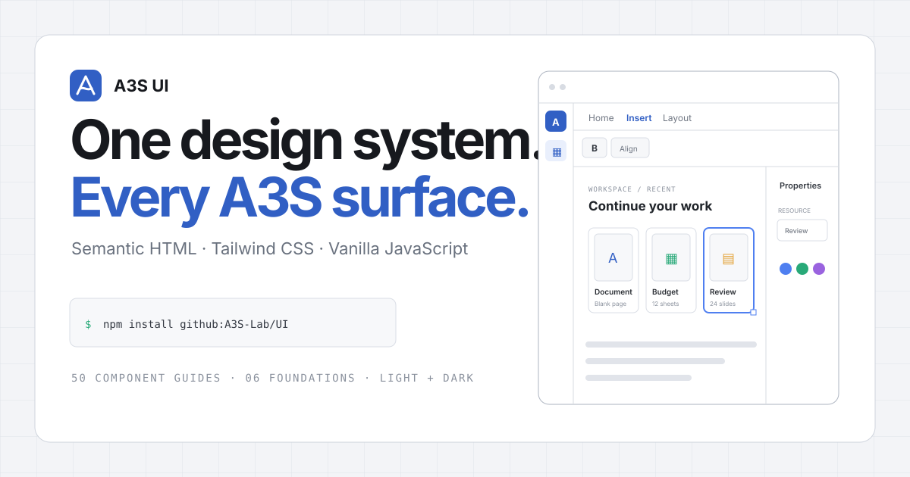
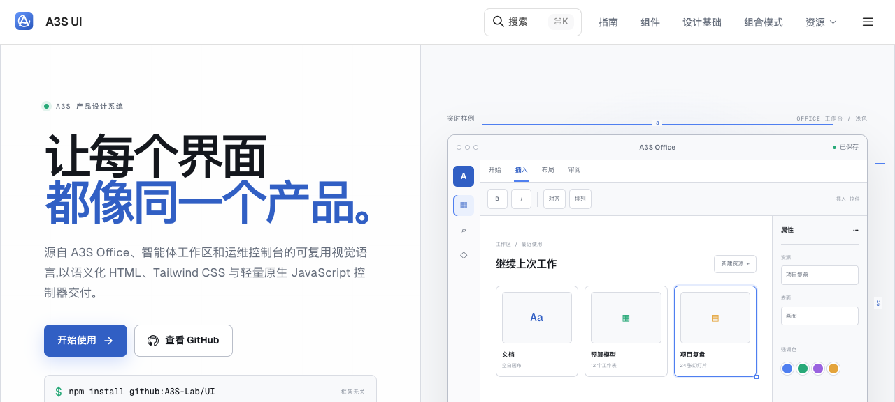

<p align="center">
  
</p>

<p align="center">
  A framework-agnostic design system for agent workspaces, document tools, and operational consoles.
</p>

<p align="center">
  <a href="https://a3s-lab.github.io/UI/"></a>
  <a href="https://a3s-lab.github.io/UI/en/"></a>
  <a href="https://github.com/A3S-Lab/UI/actions/workflows/pages.yml"></a>
  <a href="./LICENSE.md"></a>
</p>

## One visual language, from controls to workbenches

A3S UI turns the interaction patterns refined in A3S Office into reusable, semantic HTML. It combines Tailwind CSS v4, native browser elements, and small vanilla JavaScript controllers—without requiring React, Radix, or a framework runtime.

The system covers both familiar primitives and application-scale composition: App Shell, Activity Bar, Workspace Header, Toolbar, Ribbon, Settings Layout, Resource Cards, resizable Split Panes, Task Panes, and Status Bars all share the same tokens, density, and state model.

<p align="center">
  <a href="https://a3s-lab.github.io/UI/"></a>
</p>

## Start in three steps

Install directly from GitHub while the first registry release is being prepared:

```bash
npm install github:A3S-Lab/UI
```

Load Tailwind and the complete A3S bundle:

```css
@import "tailwindcss";
@import "@a3s-lab/ui";
```

Import the runtime only when the interface uses interactive composites:

```js
import "@a3s-lab/ui/all";
```

Then compose the interface with semantic markup:

```html
<header class="workspace-header">
  <div data-workspace-identity>
    <h1>Production gateway</h1>
    <span>Configuration saved</span>
  </div>
  <div data-workspace-actions>
    <button type="button" class="btn">Deploy</button>
  </div>
</header>
```

See the [installation guide](https://a3s-lab.github.io/UI/installation.html) for split CSS imports, controller-level JavaScript imports, and server-rendered templates.

## Component families

| Family | Included patterns |
| --- | --- |
| Actions | Button and Button Group |
| Forms | Fields, inputs, textareas, selects, checkboxes, radio groups, switches, sliders, labels, and comboboxes |
| Navigation | Activity Bar, Breadcrumb, Tabs, Pagination, and Sidebar |
| Overlays | Alert Dialog, Dialog, Drawer, Dropdown Menu, Popover, Command, and Tooltip |
| Feedback | Alert, Badge, Empty, Progress, Skeleton, Spinner, and Toast |
| Data display | Accordion, Avatar, Card, Chart, Item, Kbd, and Table |
| Application patterns | App Shell, Activity Bar, Workspace Header, Toolbar, Ribbon, Settings Layout, Resource Card, Split Pane, Task Pane, and Status Bar |
| Utilities | Scroll Area and Theme Switcher |

Every component guide includes a live preview, minimal usage, public parameters, states and variants, and accessibility notes. Browse the [complete component catalog](https://a3s-lab.github.io/UI/components/).

## Design foundations

The A3S theme is a complete design system rather than a palette layered over unrelated controls:

- **Color** — blue-gray product surfaces with semantic success, warning, danger, and accent roles.
- **Typography** — application-first hierarchy with dense labels and readable long-form documentation.
- **Spacing** — a consistent rhythm for controls, panels, toolbars, and document canvases.
- **Shape and elevation** — restrained radii, borders, and shadows that preserve information density.
- **Motion** — short, purposeful transitions with reduced-motion support.
- **Accessibility** — semantic elements, explicit ARIA state, keyboard interactions, RTL-aware layout, and light/dark themes.

## Application-scale patterns

The Office Workbench layer is where A3S UI differs from a primitive-only kit:

```text
App Shell
├── Activity Bar
├── Workspace Header
├── Toolbar or Ribbon
├── Resource Grid
├── Settings Layout
├── Split Pane
│   └── Task Pane
└── Status Bar
```

These patterns are independently reusable, but their tokens and layout contracts are designed to compose into document editors, coding-agent workspaces, and observability consoles.

## Documentation languages and versions

The documentation site uses the same Rspress, React, and TypeScript stack as the A3S Code website. Simplified Chinese is the default language; every published version also provides English documentation.

| Version | 简体中文 | English |
| --- | --- | --- |
| `next` | [Default documentation](https://a3s-lab.github.io/UI/) | [English documentation](https://a3s-lab.github.io/UI/en/) |
| `v0.1.0` | [Stable Chinese](https://a3s-lab.github.io/UI/v0.1.0/) | [Stable English](https://a3s-lab.github.io/UI/v0.1.0/en/) |

Language and version switches preserve the current page whenever that route exists in the destination tree.

## Package entrypoints

| Import | Purpose |
| --- | --- |
| `@a3s-lab/ui` | Complete default A3S CSS bundle |
| `@a3s-lab/ui/base` | Tokens, utilities, and structural component CSS without a visual style |
| `@a3s-lab/ui/components/{name}.css` | One component's structural CSS |
| `@a3s-lab/ui/styles/a3s.css` | A3S visual foundation for split-import builds |
| `@a3s-lab/ui/all` | Shared runtime plus all auto-initialized controllers except Chart |
| `@a3s-lab/ui/{controller}` | One JavaScript controller, such as `tabs` or `split-pane` |
| `@a3s-lab/ui/templates/*` | Nunjucks and Jinja templates for server-rendered applications |

The public runtime namespace remains `window.basecoat` for compatibility with the underlying lifecycle and controller registry.

## Development

```bash
npm ci
npm ci --prefix site
npm run build
npm run docs:build
npx playwright install chromium
npm run test:visual
```

Run the documentation site locally with `npm run docs:dev`. The static build is written to `site/doc_build` and deployed to GitHub Pages from `main`.

Visual checks use Playwright with platform-specific desktop and compact baselines. Set `A3S_UI_VISUAL_CHROMIUM_EXECUTABLE` to reuse a system Chromium installation; these checks are intentionally not part of CI.

## Lineage and license

A3S UI builds on [Basecoat](https://github.com/hunvreus/basecoat), created by [Ronan Berder](https://github.com/hunvreus), and retains its semantic HTML interpretation of the [shadcn/ui](https://ui.shadcn.com/) visual language. The A3S theme and workbench components extend that foundation for A3S products.

Released under the [MIT License](./LICENSE.md).
