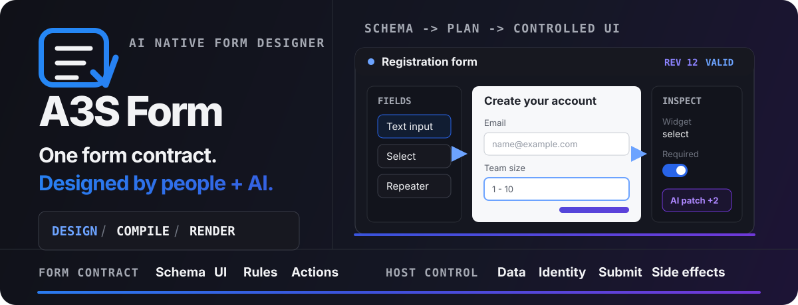
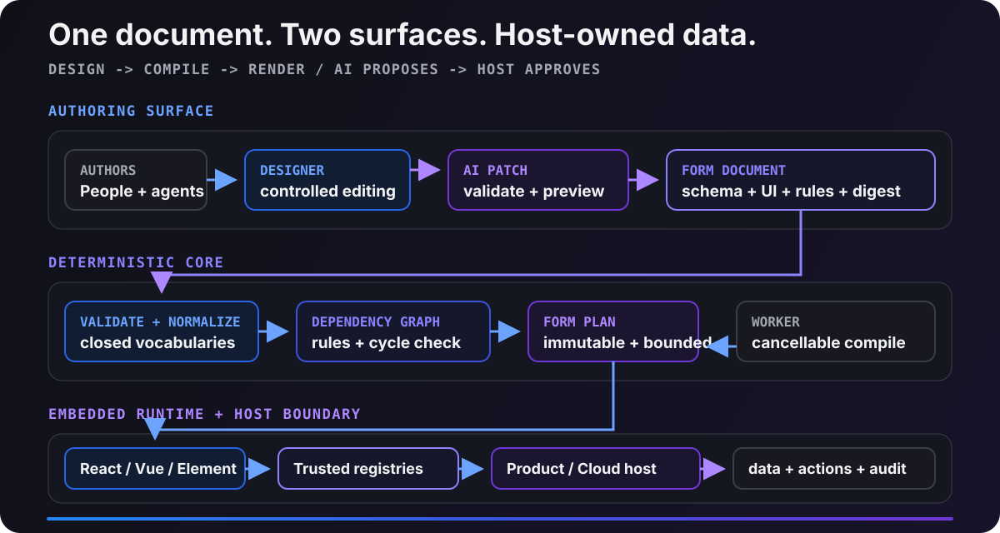

<p align="center">
  
</p>

<p align="center">
  
  
  
  <a href="https://github.com/A3S-Lab/UI/actions/workflows/pages.yml"></a>
  <a href="LICENSE"></a>
</p>

<p align="center">
  <strong>Define once, render everywhere. Every change remains reviewable.</strong><br>
  An embeddable form designer for A3S Workflow, A3S Cloud, product teams, and coding agents.
</p>

<p align="center">
  <a href="https://a3s-lab.github.io/UI/components/form-system/">Documentation</a> ·
  <a href="#quick-start">Quick Start</a> ·
  <a href="#capabilities">Capabilities</a> ·
  <a href="#architecture">Architecture</a> ·
  <a href="#embedding">Embedding</a> ·
  <a href="#agent">Coding Agent</a> ·
  <a href="#roadmap">Roadmap</a> ·
  <a href="#quality">Quality</a>
</p>

> [!NOTE]
> A3S Form is maintained inside the A3S UI repository and ships from the single `@a3s-lab/ui` package. This module contains the visual Designer, controlled Renderer, deterministic Compiler, React/Vue/Web Component adapters, React Hook Form bindings, native Vue composables, Workflow and Cloud contracts, CLI, and the `$a3s-form` skill.

<a id="quick-start"></a>

## Quick Start

The hosted documentation and embedded examples are available at:

- [Documentation](https://a3s-lab.github.io/UI/components/form-system/)

For local development, install Git and Node.js 20 or newer, then build and test the Form package from the UI repository root:

```bash
git clone https://github.com/A3S-Lab/UI.git
cd UI
npm ci
npm run form:build
npm run form:test
```

<a id="capabilities"></a>

## One Form Contract, Five Product Surfaces

A basic schema renderer only draws inputs. A3S Form gives design, preview, runtime rendering, and agent-authored changes the same semantics while making ownership of business data and side effects explicit.

| Surface | Implemented capabilities |
| --- | --- |
| **Form Designer** | Published A3S UI component contracts, explicit UX profiles for all 38 production nodes, a 23-widget field catalog with single- and multiple-choice matrices, context-aware task sections, typed default values, static or host-owned option sources, structured option and matrix editors with stable submitted values, host-owned file-upload and signature extensions, structure tree, grid/column/tab/collapse layouts, authored wizard pages and review steps, nested repeatable field groups, editable data-grid authoring with paste and fill policies, cross-container drag and drop, custom nodes, focused preview, responsive component/canvas/settings panels, undo/redo, save feedback, and compiler diagnostics |
| **Form Renderer** | A3S UI fields, controls and actions with typed controlled values, URL/phone/time/collection/business widgets, bounded host-owned file-upload and signature runtimes, responsive single- and multiple-choice matrices, true wizard branches and digest-bound checkpoints, field-level subscriptions, localized validation summaries, cancellable field/page/form validation, async action states, row-scoped rules and data sources, custom nodes, nested object repeaters, and responsive semantic data grids with sorting, filtering, bounded TSV append, visible-selection fill-down, and measured row virtualization |
| **Workflow Node Configuration** | A3S Flow 1.0 lossless DAG contracts with 18 visible host-owned node manifests, two internal container-start manifests, all 14 runtime command bindings, scoped validation, and semantic digests. The controlled A3S UI 0.3 panel and preview edit complete DAG nodes while preserving unknown presentation fields. The eight-node 0.4.2 API remains available only for A3S Flow migrations. |
| **Form Core** | Package-embedded native Rust/WASM compiler and submitted-value evaluator, exact compiler revisions, bounded byte protocols, Schema Profile 1 validation, form/row rule scopes, wildcard path binding, dependency indexes, cycle detection, capability checks, canonical SHA-256, immutable `FormPlan`, deterministic traces, and a cancellable compiler Worker |
| **Agent Interface** | JSON CLI, revision-bound `FormPatch`, in-Designer JSON preflight and conflict feedback, `$a3s-form` skill, machine-readable diagnostics, and atomic changes |

### A3S Flow 1.0 DAG contract

The primary workflow path follows A3S Flow `1.0.0` and the tested workflow DSL `0.7.0`. Flow owns lossless DAG structure, node and edge limits, scopes, container invariants, deterministic ordering, and semantic digests. The host owns each `node.data.type`, its `A3SFlowDagNodeManifest`, property semantics, ports, compilation, credentials, persistence, and execution. The built-in registry contains 18 visible manifests across seven groups plus the internal `iteration-start` and `loop-start` nodes.

Configuration edits replace only manifest-owned properties, preserve `data.type`, and retain unknown authoring or presentation extensions on the DAG node. Dynamic inputs and mappings continue to use the runtime-neutral `a3s.dev/flow-expression/v1` JSON AST. DAG compilation checks IDs, endpoints, scopes, cycles, and container starts; execution digests exclude position, viewport, selection, sizing, animation, and style.

```tsx
const manifest = requireA3SFlowDagNodeManifest('flow.step');
const [dagNode, setDagNode] = useState(() =>
  createA3SFlowDagNode('step-fetch-customer', manifest),
);

<A3SFlowDagNodePreview dagNode={dagNode} manifest={manifest} />
<A3SFlowDagNodeConfigurationPanel
  dagNode={dagNode}
  manifest={manifest}
  onChange={setDagNode}
  onApply={saveDagNode}
  onRequestConnection={openConnectionPicker}
/>
```

See the [A3S Flow DAG-node configuration guide](https://a3s-lab.github.io/UI/components/form-system/workflow-node-embedding) for the ownership boundary, manifest registry, React API, structural validation, semantic digest, and migration path. `A3SFlowNodeConfigurationPanel`, `A3SFlowNodePreview`, and the eight-node 0.4.2 catalog remain available for migration, but are no longer the primary editor contract.

Core invariants:

- `FormDocument` is the single source of truth for schema, UI, rules, references, revision, and digest.
- Designer and Renderer consume the same compiler-produced `FormPlan`.
- Browser, Node, Worker, CLI, and native hosts use the same Rust/WASM Form Core for compilation and submitted-value evaluation; TypeScript implementations are retained only as conformance references.
- AI submits bounded patches; revision conflicts fail instead of overwriting newer human work.
- Components emit values and actions only. Persistence, identity, authorization, secrets, and side effects belong to the host.
- Form Core has no platform dependency. React, Vue, and Web Component surfaces accept controlled host state and do not install global CSS resets.
- Documents never execute arbitrary JavaScript. Widget, data-source, and action keys resolve only through host-approved registries.
- Durable human submissions are request-bound: WorkflowRun, Flow hook, step attempt, HumanTask, exact Form release, assignment policy, claimant, task version, deadlines, allowed outcomes, output mapping, idempotency, and canonical value digest are validated together.
- Protected workflow and interaction acceptance recompiles the pinned release, evaluates the candidate through native Form Core, enforces the output bound, and persists only the evaluator-produced value.

Authoring and runtime behavior:

- Designer hosts import a JSON document only after it compiles successfully.
- Preview mode removes the component catalog and inspector so the real form runtime owns the canvas. On compact screens, authoring switches between dedicated Components, Canvas, and Settings panels without horizontal overflow.
- Clicking a catalog item appends it to the form root, so the result does not depend on a stale selection. Dragging is the explicit path for exact placement inside columns, tabs, repeaters, data grids, and custom containers; incompatible data-grid children are rejected before the document changes.
- The inspector uses the published A3S UI task-pane, tabs, accordion, field, input-group, item, badge, and button contracts. Every production node has an explicit label, category, purpose, common-setting order, advanced-setting order, and editor density. Content and component behavior stay visible; component type, initial value, data contracts, layout details, submitted values, matrix row IDs, and bulk grid controls expand only when needed. Typed defaults use the same native control as the runtime, including UTC date-time and time inputs. Choice and matrix editors preserve stable values while synchronizing structural edits with JSON Schema. Extensions compose the exported `FormInspectorControl`, `FormInspectorSection`, `FormInspectorSettingGroup`, and `FormInspectorToggle` primitives instead of maintaining a second panel style.
- Designer previews render the same field components as the runtime inside an inert boundary. Editable fields keep their normal A3S UI appearance, while read-only and computed fields retain an explicit disabled state. A3S UI remains responsible for native checkbox, switch, accordion, alert, field, and table states; the Form stylesheet supplies only form-specific layout and responsive composition around those controls.
- Save actions expose saving, saved, and failed states. `Cmd/Ctrl+S` uses the same save path as the toolbar action.
- The Agent panel accepts deterministic `FormPatch` JSON, shows the current revision and protocol, validates the payload before applying it, and reports revision conflicts without mutating the document.
- Draft actions receive the current controlled value without being blocked by required-field validation. Submit actions run synchronous and host-owned asynchronous validation, show a summary, and focus the first invalid field.

> [!IMPORTANT]
> The v0.1 contract is a foundation, not a claim of full JSON Schema or enterprise-form parity. The unreleased `next` baseline now covers the A3S Flow 1.0 DAG and host-manifest contract, Schema Profile 1, computed rules, host-neutral embedding, async validation, dynamic data sources, field subscriptions, runtime locale catalogs, large-form budgets, nested repeatable field groups, per-row rule/data-source binding, controlled multi-page wizards, inline and dialog-edit data grids with sorting, filtering, bulk selection, bounded TSV append, visible-selection fill-down, measured row virtualization, single- and multiple-choice matrices, a 23-widget built-in field catalog, and host-owned file-upload and signature extensions. Draft/release collaboration remains planned work. See the [product roadmap](ROADMAP.md) for scope and release gates.

Existing integrations should follow the [v0.1-to-next migration checklist](docs/migration-v0.1-to-next.md) before publishing a new form revision or digest.

### Minimal React embedding

```tsx
import { assertCompiled } from '@a3s-lab/ui/form/core';
import { FormDesigner, FormRenderer } from '@a3s-lab/ui/form/react';
import '@a3s-lab/ui/form/a3s-ui.css';

const plan = assertCompiled(document);

<FormDesigner document={document} onChange={setDocument} />

<FormRenderer
  plan={plan}
  value={value}
  onChange={setValue}
  onAction={handleAction}
/>
```

### React Hook Form

`@a3s-lab/ui/form/react-hooks` uses React Hook Form for registration, subscriptions, field arrays, and minimal rerenders while A3S Form Core remains authoritative for computed rules, Schema Profile 1, Rust/WASM semantics, localization, and synchronous or host-owned asynchronous validation.

```tsx
import { FormRenderer } from '@a3s-lab/ui/form/react';
import { useA3SForm, useFieldArray } from '@a3s-lab/ui/form/react-hooks';

const form = useA3SForm<FormValues>({
  plan,
  defaultValues,
  mode: 'onChange',
  hostAdapter,
});
const recipients = useFieldArray({ control: form.control, name: 'recipients' });

<FormRenderer
  {...form.rendererProps}
  onAction={(actionId) => {
    if (actionId === 'submit') void form.handleSubmit(save)();
  }}
/>;
```

The entrypoint also re-exports `Controller`, `FormProvider`, `useController`, `useFieldArray`, `useFormContext`, `useFormState`, `useWatch`, and their public types. `createA3SFormResolver`, `toReactHookFormErrors`, and `toA3SFormErrors` are available when an application owns the React Hook Form instance.

### Vue composables

`@a3s-lab/ui/form/vue-hooks` provides framework-native reactive state without requiring React Hook Form. `useA3SForm`, `useA3SField`, `useA3SFieldArray`, `provideA3SForm`, and `useA3SFormContext` share the same A3S Form Core validation and computed-rule behavior as React.

```vue
<script setup lang="ts">
import { A3SFormRenderer } from '@a3s-lab/ui/form/vue';
import { provideA3SForm, useA3SField, useA3SForm } from '@a3s-lab/ui/form/vue-hooks';

const form = provideA3SForm(useA3SForm<FormValues>({ plan, initialValues, hostAdapter }));
const { value: name, errorMessage, handleBlur } = useA3SField<FormValues, string>({
  name: 'name',
});
const submit = form.handleSubmit(save);

function handleAction(event: { actionId: string }) {
  if (event.actionId === 'submit') void submit();
}
</script>

<template>
  <input v-model="name" @blur="handleBlur" />
  <span v-if="errorMessage">{{ errorMessage }}</span>
  <A3SFormRenderer
    :plan="form.plan.value"
    :model-value="form.values.value"
    :errors="[...form.errors.value]"
    @update:model-value="form.rendererProps.value.onChange"
    @action="handleAction"
  />
</template>
```

`@a3s-lab/ui/form/a3s-ui.css` loads the published A3S UI 0.3.0 bundle, the Form layout layer, and the A3S Flow node-panel styles. Use `@a3s-lab/ui/form/styles.css` instead when an embedding host must remain fully isolated from document-level CSS; add `@a3s-lab/ui/form/a3s-flow.css` only when that host renders A3S Flow node panels. The scoped entries do not install a global preflight. All entries use the same A3S UI semantic markup for fields, buttons, tabs, accordions, tables, and range controls.

<a id="architecture"></a>

## Architecture

<p align="center">
  
</p>

```text
                 Human author                    Coding Agent
                    │                       CLI / $a3s-form skill
                    └────────────┬────────────────────┘
                                 │ reviewed + validated FormPatch
                                 ▼
                     ┌────────────────────────┐
          Designer ◄─┤ canonical FormDocument├─► revision + SHA-256
                     └────────────┬───────────┘
                                  │
                                  ▼
                 Portable Rust/WASM Form Core / Worker
                                  │ immutable FormPlan
                   ┌──────────────┼──────────────┐
                   ▼              ▼              ▼
                React          Vue 3       Web Component
                   └──────────────┼──────────────┘
                                  │ controlled value / action
                   ┌──────────────┴──────────────────────────┐
                   ▼                                         ▼
        A3S Workflow (FormRef / durable run)      A3S Cloud (tenant / auth / data)
```

`FormDocument` contains:

```text
schema          closed A3S Form Schema Profile 1 contract
ui              nodes, layouts, widget keys, hints, and options
rules           pure visible / enabled / computed / validate expressions
dataSources     declarative data requests resolved by the host
actions         declarative actions resolved by the host
metadata        title, locale, ownership, and compatibility information
revision        optimistic version
digest          canonical SHA-256
```

See [Architecture](docs/architecture.md), [Portable submitted-value evaluation](docs/value-evaluation.md), and [Security Boundaries](docs/security.md) for the complete design.

The development compiler enforces [A3S Form Schema Profile 1](docs/schema-profile-1.md). Unsupported JSON Schema keywords fail with an exact path. Successful plans record `schemaProfile: "a3s.dev/form-schema-profile/1"`; `const`, `enum`, `uniqueItems`, `additionalProperties`, and the approved format set use the same semantics in headless and embedded runtimes.

[Deterministic computed rules](docs/computed-rules.md) derive workflow-node parameters in a stable topological order. Arithmetic and branching stay inside the bounded expression language; explicit row scope binds nested repeater paths, isolates failures, and produces concrete traces.

[Host-owned asynchronous validation](docs/async-validation.md) runs on field blur and before primary submit. Controlled value changes cancel pending requests, late responses are ignored, and host issues map to stable `async.<code>` field errors without exposing upstream exceptions.

[Host-owned data sources](docs/data-sources.md) load workflow-node options through approved host registries. Declared static or row-template dependencies prevent unrelated refetches; concrete request scope, focus triggers, isolated TTL caches, request deduplication, search, pagination, cancellation, and accessible failure states share one React/Vue/Web Component contract.

[Runtime localization](docs/localization.md) uses one versioned catalog across core validation, React, Vue, Web Components, and Designer preview. Host overrides change product copy without changing or republishing a `FormDocument`.

[Performance budgets](docs/performance.md) cover compilation, validation, incremental computed-rule updates, and server rendering at 100, 500, and 1,000 nodes. The same benchmark runs in CI.

[Repeatable field groups](docs/repeatable-field-groups.md) bind object arrays to real row templates. Rows can be added, removed, reordered, calculated, validated, and conditionally rendered without serializing runtime keys into workflow configuration. A host may derive stable identity from business data through `identifyRepeaterItem`; declaring `itemKey` remains an explicit document choice.

[Editable data grids](docs/data-grids.md) present an object repeater as a semantic table on desktop and labeled row cards in narrow embedded containers. Columns, row actions, validation, rules, host-owned data sources, bounded TSV append, and visible-selection fill-down keep the same metadata-free controlled value contract.

[Matrix fields](https://a3s-lab.github.io/UI/components/form-system/matrix-fields) bind explicit rows and columns to an object Schema. Single-choice rows emit one JSON primitive, multiple-choice rows emit primitive arrays, and the Renderer switches from a semantic table to row cards according to the embedding container width.

[Multi-page wizards](docs/wizards.md) provide visible-rule branches, page-scoped validation, progress, review, earlier-page error recovery, and digest-bound host checkpoints. Navigation state stays outside submitted values and remains controlled across React, Vue, Web Components, and Designer preview.

[Built-in fields](docs/built-in-fields.md) define the value, Schema, UI properties, keyboard behavior, limits, and host boundaries for all 23 widgets. The versioned Chinese documentation renders the real controlled components through MDX.

[Layout components](https://a3s-lab.github.io/UI/components/form-system/layouts) document and render the grid, two-column, three-column, card, tabs, collapse, content, divider, and spacer contracts. The [wizard guide](https://a3s-lab.github.io/UI/components/form-system/wizards) includes a live page-validation and review flow.

[File upload](https://a3s-lab.github.io/UI/components/form-system/file-upload) defines the closed JSON reference, typed host service, Designer settings, upload lifecycle, accessibility behavior, and security boundary for React, Vue, and Web Components.

[Signature](https://a3s-lab.github.io/UI/components/form-system/signature) captures bounded pointer strokes or a typed signing name in browser memory while a typed host service owns storage, authorization, atomic replacement, deletion, preview, and audit. Controlled values contain only a closed single-reference array.

<a id="embedding"></a>

## Embedding Boundaries for A3S Cloud and Workflow

| Integration | Contract |
| --- | --- |
| **A3S Cloud** | `createA3SCloudFormAdapter` injects organization/project/environment context, data sources, async validation, and actions. Cloud retains ownership of authorization, storage, secrets, and audit logs. |
| **Workflow node configuration** | `A3SFlowDagNodeConfigurationPanel` and `A3SFlowDagNodePreview` edit a complete `A3SFlowWorkflowDagNode` through a host-owned manifest. Flow owns DAG validation, scopes, and semantic digest; the host owns `data.type`, properties, compilation, and persistence. `createWorkflowNodeConfiguration` and `validateWorkflowNodeConfiguration` remain the digest-pinned host save boundary. |
| **Durable human interaction** | Cloud issues a digest-bound v1 request that pins the WorkflowRun, Flow hook, step attempt, HumanTask, exact `FormReleaseRef`, assignment and task policy. A submission is accepted only with matching protected Cloud context and Form validation; browsers never resume Flow directly. |
| **A3S Code agentic nodes** | An agent may request governed form interaction but receives no open browser, production credentials, or unbounded action channel. |

Form upgrades never mutate published workflows silently. An in-flight run is always validated against its original request and Form release. The TypeScript and native Rust implementations share [`interaction-contract-v1.json`](tests/conformance/interaction-contract-v1.json) for byte-identical request and value digests. The core compiler has no database or network dependency, so it can scale independently as a stateless task in a Worker, local process, or isolated host runtime.

Supported exports:

| Export | Purpose |
| --- | --- |
| `@a3s-lab/ui/form/core` | Documents, compilation, validation, locale catalogs, patches, templates, and headless state |
| `@a3s-lab/ui/form/a3s-flow` | Flow 1.0 workflow DSL types, DAG validation and digest, host-owned manifest registry, built-in 20-manifest catalog, node factories, expression contract, and migration APIs |
| `@a3s-lab/ui/form/react` | React Designer, Renderer, Flow 1.0 DAG-node panel and preview, legacy core-node surfaces, and workflow configuration widgets |
| `@a3s-lab/ui/form/react-hooks` | React Hook Form-compatible state, resolver, subscriptions, field arrays, error mapping, and controlled Renderer binding |
| `@a3s-lab/ui/form/vue` | Vue 3 `v-model` adapter |
| `@a3s-lab/ui/form/vue-hooks` | Native Vue form, field, field-array, injection-context, state, validation, submission, and controlled Renderer composables |
| `@a3s-lab/ui/form/web-component` | `<a3s-form-designer>` and `<a3s-form-renderer>` |
| `@a3s-lab/ui/form/cloud` | A3S Cloud host adapter |
| `@a3s-lab/ui/form/workflow` | Workflow-node configuration, FormRef verification, request-bound interaction builders, inspectors, digests, and protected submission validation |
| `@a3s-lab/ui/form/compiler.worker.js` | Cancellable browser compiler Worker |
| `@a3s-lab/ui/form/styles.css` | Scoped A3S UI-compatible tokens plus the base Form layout and interaction states; no host-global reset |
| `@a3s-lab/ui/form/a3s-flow.css` | Scoped styles for A3S Flow node panels and previews; load with `styles.css` in isolated embedding hosts |
| `@a3s-lab/ui/form/a3s-ui.css` | Published A3S UI bundle plus the base Form and A3S Flow layout layers; recommended for A3S products and standalone surfaces |

See the [Embedding Guide](docs/embedding.md), the tested [workflow-node React host](examples/workflow-node-settings-host.tsx), and the [Integration Guide](docs/integration.md).

<a id="agent"></a>

## Coding Agent CLI and Skill

After building the project, every `a3s-form` command emits JSON and can be composed by local coding agents such as Codex:

```bash
node dist/form/cli.js sample --output form.json --pretty
node dist/form/cli.js validate form.json --pretty
node dist/form/cli.js compile form.json --output plan.json --pretty
node dist/form/cli.js diff before.json after.json --output change.patch.json --pretty
node dist/form/cli.js patch form.json change.patch.json --output candidate.json --pretty
node dist/form/cli.js digest candidate.json
```

Recommended agent flow:

```text
validate current
  -> generate a FormPatch bound to baseRevision
  -> patch into a candidate
  -> validate the candidate
  -> provide a diff for human or host review
  -> replace the document and pin a new digest only after approval
```

The skill lives at [`skills/a3s-form`](skills/a3s-form/SKILL.md). It requires the agent to treat the CLI as the semantic authority, never infer a document by scraping the UI, and never fabricate revisions or digests.

<a id="roadmap"></a>

## Product Roadmap

A3S Form is planned as five coordinated product layers: deterministic Form Core, an accessible Runtime, a complete visual Studio, lifecycle Governance, and a policy-bound Agent interface. Submission storage, files, payments, webhooks, analytics, identity, and secrets remain A3S Cloud or host responsibilities behind stable Form contracts.

| Milestone | Product outcome |
| --- | --- |
| **v0.1 · current** | Prove the versioned document, deterministic compiler, controlled runtime, visual Designer, host adapters, and governed patch model. |
| **v0.2 · runtime integrity** | Lock down host-neutral embedding, schema and computed semantics, async validation, data sources, localization, and incremental performance. |
| **v0.3 · complex forms** | The A3S Flow 1.0 DAG and host-manifest contract, 18-node primary catalog, scoped validation and semantic digests, graph-node preview, semantically grouped compact configuration panel, nested object repeaters, stable row reordering, row-scoped rules, row-bound data sources, controlled multi-page wizards, sortable, filterable, virtualized dialog-edit data grids with bulk selection, bounded TSV append and fill-down, single- and multiple-choice matrices, a 23-widget built-in field kit, and host-owned file-upload and signature extensions are implemented; remaining official extensions and visual rule/integration editors follow. |
| **v0.4 · governance** | Add draft/release history, diff and rollback, approvals, collaboration contracts, offline sync, audit, policy, and migration tools. |
| **v1.0 · AI-native production** | Stabilize contracts and deliver inspect → patch → simulate → test → approve → publish workflows across people, agents, Cloud, and Workflow. |

The complete scope, non-goals, and acceptance criteria live in [ROADMAP.md](ROADMAP.md). Planned work is not described as implemented until its release gates pass.

<a id="quality"></a>

## Verifiable Quality Baseline

Current full runtime coverage:

| Metric | Coverage |
| --- | ---: |
| Statements | **≥ 95% CI gate** |
| Branches | **≥ 95% CI gate** |
| Functions | **≥ 95% CI gate** |
| Lines | **≥ 95% CI gate** |

- The complete unit, contract-conformance, and cross-framework integration suite passes in CI.
- A3S Flow manifest, workflow-node form, graph preview, and panel suites cover default alignment, semantic layouts, host actions, and every built-in manifest.
- The unified A3S UI browser suites cover the published component documentation and retain bounded local evidence.
- CI installs locked dependencies and runs linting, type checks, coverage gates, 100/500/1,000-node performance budgets, package/CLI builds, and documentation builds.

```bash
npm run form:check
```

## GitHub Pages

Every push to `main` runs [the Pages workflow](../../.github/workflows/pages.yml), builds the unified A3S UI documentation, verifies the embedded Form guides, and deploys the shared site through GitHub Actions.

- Site: <https://a3s-lab.github.io/UI/components/form-system/>
- English: <https://a3s-lab.github.io/UI/en/components/form-system/>
The Form guides follow A3S UI's bilingual versioned documentation contract. Chinese is the default language; no standalone Form documentation site or demo route is published.

## Repository Layout

```text
site/docs/next/*/components/form-system/  unified bilingual component guides
modules/form/src/core/         documents, compiler, patches, expressions, state, and WASM
modules/form/src/react/        Designer, Renderer, control system, and custom node registry
modules/form/src/adapters/     A3S Cloud host adapter
modules/form/src/integrations/ A3S Workflow FormRef and interaction contracts
modules/form/src/workers/      cancellable compiler Worker/client
modules/form/skills/a3s-form/  coding agent skill
modules/form/tests/            unit, integration, and local A3S Test coverage
modules/form/wasm/             Rust/WASM sources for Form semantics and SHA-256
modules/form/docs/             architecture, integration, and security references
```

## License

A3S Form is available under the [MIT License](LICENSE).
